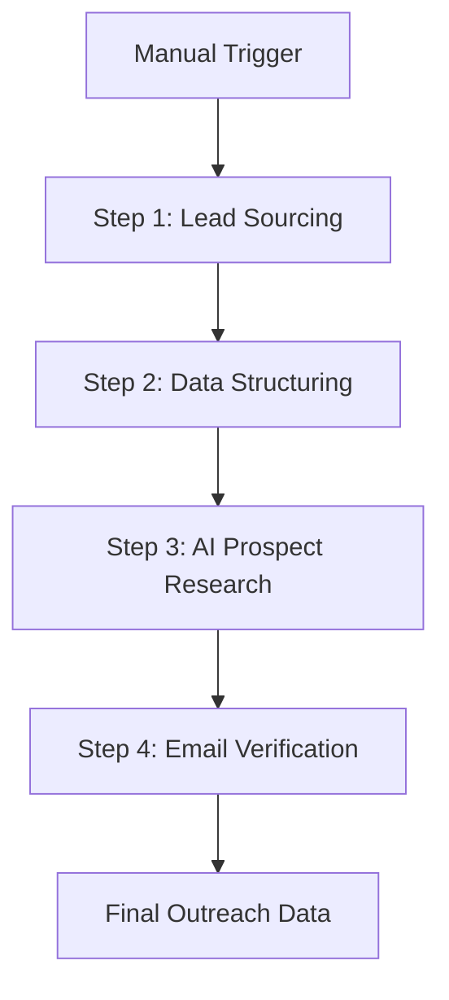

# Lead Generation System Architecture

This project is an automated, AI-powered lead generation engine built using **n8n**. It orchestrates a multi-stage workflow to source, research, and verify high-quality business leads.

## 🏗️ System Overview

The architecture follows a linear, four-stage pipeline designed to transform broad search keywords into verified, research-backed outreach data.

---

## 🛠️ Core Components & Technologies

- **Orchestration:** [n8n](https://n8n.io/)
- **Lead Sourcing:** [SerpAPI](https://serpapi.com/) (Google Maps Engine)
- **AI Engine:** [Google Gemini 2.0 Flash](https://ai.google.dev/) (via LangChain nodes)
- **Email Verification:** [Reoon Email Verifier](https://www.reoon.com/email-verifier/)
- **Database/CRM:** [Google Sheets](https://www.google.com/sheets/about/)

---

## 📑 Workflow Stages

### 1. Lead Sourcing (Google Maps Scraper)
- **Input:** Search keywords (e.g., "Physiotherapist in New York") stored in the `Keywords` sheet.
- **Process:** Uses **SerpAPI** to scrape business listings from Google Maps.
- **Features:** Automated pagination handling and "Status" updates (✅/❌) in the source sheet.
- **Output:** Raw business details (Name, Website, Phone, Rating) saved to the `Serp Raw Data` sheet.

### 2. Data Structuring & Deduplication
- **Process:** Compares incoming data against existing records in the `Raw Data` sheet.
- **Logic:** Removes duplicates based on Website/Place ID and filters out entries without valid websites.
- **Output:** Cleaned, unique business profiles ready for deep research.

### 3. AI-Powered Prospect Research
- **AI Model:** **Google Gemini 2.0 Flash**.
- **Agentic Logic:** Uses a LangChain-based AI Agent with a **Structured Output Parser**.
- **Research Goal:** Identifies the Owner/CEO/Decision Maker, their Job Title, Seniority level, and social media profiles (LinkedIn, Facebook, Instagram).
- **Strategy:** The agent is prompted to research official websites, directories (Yelp, Yellow Pages), and social platforms to ensure high data integrity.

### 4. Email Verification
- **Tool:** **Reoon API**.
- **Process:** Validates found emails for deliverability, SMTP connection, and "safe-to-send" status.
- **Categorization:** Automatically marks leads as **Safe** (Ready for outreach) or **Risky** (Requires manual review).

---

## 📊 Data Schema (Google Sheets)

| Sheet Name | Purpose | Key Fields |
| :--- | :--- | :--- |
| **Keywords** | Source of truth for searches | `Keywords`, `Status` |
| **Serp Raw Data** | Raw scraper output | `Business Name`, `Website`, `Map Link` |
| **Raw Data** | Master lead repository | `Owner Name`, `Job Title`, `Email`, `LinkedIn` |
| **Outreach Data** | Final verified leads | `Verified Email`, `Status`, `Overall Score` |

---

## 🛡️ Security & Reliability
- **Error Handling:** Nodes are configured with `Continue on Fail` logic to ensure the workflow doesn't stall on single-entry errors.
- **Scalability:** Uses `Limit` nodes to control batch sizes and manage API rate limits effectively.
- **Modularity:** Each step is logically isolated, allowing for easy updates to the AI model or scraper engine without rebuilding the entire pipeline.
